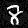

# Fast Gradient Sign Method (FGSM)

This is a rough implementation of the "fast gradient sign method" from the [Explaining and Harnessing Adversarial Examples paper by Ian Goodfellow et al.](https://arxiv.org/abs/1412.6572) on the MNIST dataset.

## Results

As you can see, even though both images are remarkably similar the model is incorrect after introducing a small perturbation using the fast gradient sign method.

| Image                                             | Prediction | Actual | Correct? |
| ------------------------------------------------- | ---------- | ------ | -------- |
|  | 6          | 6      | True     |
|  | 2          | 6      | False    |
|  | 8          | 8      | True     |
|  | 2          | 8      | False    |
|  | 5          | 5      | True     |
|  | 3          | 5      | False    |
|  | 0          | 0      | True     |
|  | 2          | 0      | False    |
|  | 3          | 3      | True     |
|  | 1          | 3      | False    |
